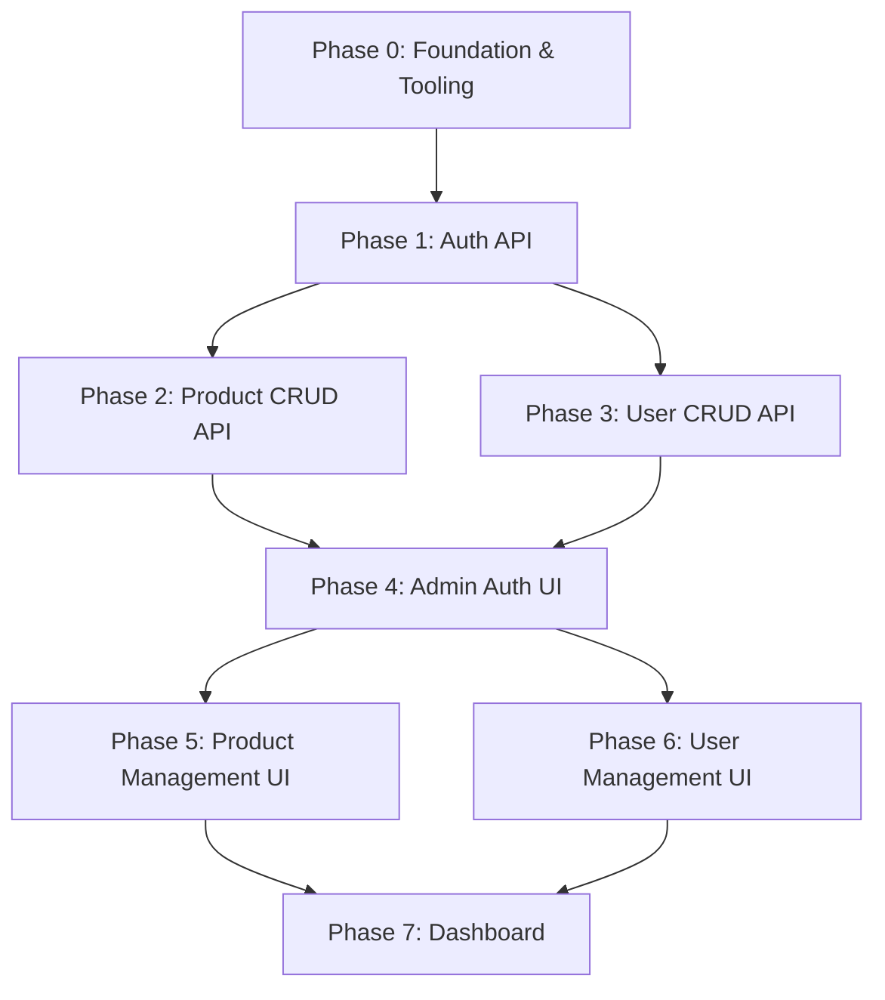

# Jewellery E-Commerce — Structured Implementation Flow

> **Strategy:** Backend API-first, then Admin UI. Each phase is self-contained
> and testable before moving to the next.

---

## Phase 0 — Project Foundation & Tooling

> **Goal:** Install all dependencies, configure Supabase, set up the folder
> skeleton, and wire environment variables.

### 0.1 Dependency Installation

| Package                        | Purpose                            |
| ------------------------------ | ---------------------------------- |
| `@supabase/supabase-js`        | Supabase client SDK                |
| `@supabase/ssr`                | SSR cookie helpers for Next.js     |
| `zod`                          | Schema validation (API + forms)    |
| `zustand`                      | Client-side UI state               |
| `@tanstack/react-query`        | Server-state caching on client     |
| `nuqs`                         | URL-synced filter/search state     |
| `framer-motion`                | Animations                         |
| `next-cloudinary`              | Cloudinary image upload widget     |
| `bcryptjs` + `@types/bcryptjs` | Password hashing                   |
| `jose`                         | JWT manipulation (edge-compatible) |
| `sonner`                       | Toast notifications                |
| `lucide-react`                 | Icon library                       |
| `shadcn/ui`                    | Component primitives (init + add)  |

### 0.2 Environment Variables (`.env.local`)

```env
NEXT_PUBLIC_SUPABASE_URL=
NEXT_PUBLIC_SUPABASE_ANON_KEY=
SUPABASE_SERVICE_ROLE_KEY=

CLOUDINARY_CLOUD_NAME=
CLOUDINARY_API_KEY=
CLOUDINARY_API_SECRET=
NEXT_PUBLIC_CLOUDINARY_CLOUD_NAME=
NEXT_PUBLIC_CLOUDINARY_UPLOAD_PRESET=

ADMIN_EMAIL=
ADMIN_PASSWORD=

JWT_SECRET=
```

### 0.3 Supabase Client Setup

| File                         | Type   | Notes                               |
| ---------------------------- | ------ | ----------------------------------- |
| `src/lib/supabase/client.ts` | Client | `createBrowserClient()`             |
| `src/lib/supabase/server.ts` | Server | `createServerClient()` with cookies |
| `src/lib/supabase/admin.ts`  | Admin  | Uses `SUPABASE_SERVICE_ROLE_KEY`    |
| `src/lib/supabase/types.ts`  | Types  | Generated DB types                  |

### 0.4 Scaffold Feature Directories

```text
src/
 ├── app/
 │    ├── api/                    # API Route Handlers
 │    │    ├── auth/
 │    │    ├── admin/
 │    │    │    ├── products/
 │    │    │    └── users/
 │    │    └── upload/
 │    ├── admin/                  # Admin Pages (UI)
 │    │    ├── layout.tsx
 │    │    ├── page.tsx            # Dashboard
 │    │    ├── products/
 │    │    └── users/
 │    └── (auth)/
 │         └── login/
 ├── features/
 │    ├── auth/
 │    │    ├── services/
 │    │    ├── hooks/
 │    │    └── components/
 │    ├── products/
 │    │    ├── services/
 │    │    ├── hooks/
 │    │    ├── components/
 │    │    └── store/
 │    └── users/
 │         ├── services/
 │         ├── hooks/
 │         ├── components/
 │         └── store/
 ├── lib/
 │    ├── supabase/
 │    ├── cloudinary.ts
 │    ├── utils.ts
 │    └── validators.ts
 └── components/                  # Shared UI (shadcn)
```

### 0.5 Supabase Database Schema (SQL / Dashboard)

```sql
-- USERS TABLE
create table public.users (
  id            uuid primary key default gen_random_uuid(),
  email         text unique not null,
  password_hash text not null,
  full_name     text,
  phone         text,
  avatar_url    text,
  role          text not null default 'customer' check (role in ('admin','customer')),
  is_active     boolean default true,
  created_at    timestamptz default now(),
  updated_at    timestamptz default now()
);

-- PRODUCTS TABLE
create table public.products (
  id            uuid primary key default gen_random_uuid(),
  name          text not null,
  slug          text unique not null,
  description   text,
  price         numeric(10,2) not null,
  compare_price numeric(10,2),
  category      text not null,
  material      text,
  weight        text,
  stock         integer not null default 0,
  is_active     boolean default true,
  created_at    timestamptz default now(),
  updated_at    timestamptz default now()
);

-- PRODUCT IMAGES TABLE
create table public.product_images (
  id            uuid primary key default gen_random_uuid(),
  product_id    uuid references public.products(id) on delete cascade,
  url           text not null,
  public_id     text not null,   -- Cloudinary public_id
  is_primary    boolean default false,
  sort_order    integer default 0,
  created_at    timestamptz default now()
);

-- RLS Policies (enable on each table)
-- Admin: full access via service_role key
-- Anon/Customer: read-only on products, own-row on users
```

### 0.6 Admin Seed Script

- `src/lib/seed-admin.ts` — Reads `ADMIN_EMAIL` / `ADMIN_PASSWORD` from env,
  hashes password with `bcryptjs`, upserts into `users` table with
  `role = 'admin'`.
- Executed manually via `npx tsx src/lib/seed-admin.ts` or as a Supabase
  migration seed.

---

## Phase 1 — Auth API (Backend)

> **Goal:** Complete auth API with JWT sessions stored in HTTP-only cookies.

### API Routes

| Method | Route              | Description          |
| ------ | ------------------ | -------------------- |
| POST   | `/api/auth/login`  | Validate creds → JWT |
| POST   | `/api/auth/logout` | Clear session cookie |
| GET    | `/api/auth/me`     | Return current user  |

### Implementation Details

| File                                         | Purpose                                                                             |
| -------------------------------------------- | ----------------------------------------------------------------------------------- |
| `src/app/api/auth/login/route.ts`            | Validate email+password via Supabase, sign JWT, set HTTP-only cookie                |
| `src/app/api/auth/logout/route.ts`           | Delete session cookie                                                               |
| `src/app/api/auth/me/route.ts`               | Verify JWT, return user payload                                                     |
| `src/features/auth/services/auth-service.ts` | `login()`, `getCurrentUser()`, `verifyToken()`                                      |
| `src/lib/jwt.ts`                             | `signToken()`, `verifyToken()` using `jose`                                         |
| `src/middleware.ts`                          | Protect `/admin/*` and `/api/admin/*` routes — redirect unauthenticated to `/login` |

### Validation Schema (`zod`)

```ts
const loginSchema = z.object({
  email: z.string().email(),
  password: z.string().min(6),
});
```

### Testing Checklist

- [ ] `POST /api/auth/login` with valid admin creds → 200 + `Set-Cookie`
- [ ] `POST /api/auth/login` with invalid creds → 401
- [ ] `GET /api/auth/me` with cookie → 200 + user payload
- [ ] `GET /api/auth/me` without cookie → 401
- [ ] Middleware redirects unauthenticated `/admin` → `/login`

---

## Phase 2 — Product CRUD API (Backend)

> **Goal:** Complete REST API for managing products and their images.

### API Routes

| Method | Route                      | Description                      |
| ------ | -------------------------- | -------------------------------- |
| GET    | `/api/admin/products`      | List all (paginated, filterable) |
| GET    | `/api/admin/products/[id]` | Get single product               |
| POST   | `/api/admin/products`      | Create product                   |
| PATCH  | `/api/admin/products/[id]` | Update product                   |
| DELETE | `/api/admin/products/[id]` | Delete product                   |

### Image Routes

| Method | Route               | Description                           |
| ------ | ------------------- | ------------------------------------- |
| POST   | `/api/upload/image` | Upload to Cloudinary, return URL      |
| DELETE | `/api/upload/image` | Delete from Cloudinary by `public_id` |

### Implementation Files

| File                                                | Purpose                                                                                      |
| --------------------------------------------------- | -------------------------------------------------------------------------------------------- |
| `src/app/api/admin/products/route.ts`               | GET (list) + POST (create)                                                                   |
| `src/app/api/admin/products/[id]/route.ts`          | GET (single) + PATCH (update) + DELETE                                                       |
| `src/app/api/upload/image/route.ts`                 | Cloudinary upload/delete proxy                                                               |
| `src/features/products/services/product-service.ts` | `getProducts()`, `getProductById()`, `createProduct()`, `updateProduct()`, `deleteProduct()` |
| `src/features/products/services/image-service.ts`   | `uploadImage()`, `deleteImage()`, `setPrimaryImage()`                                        |
| `src/lib/cloudinary.ts`                             | Cloudinary SDK config + upload utility                                                       |
| `src/lib/validators.ts`                             | `productSchema`, `productUpdateSchema` (Zod)                                                 |

### Validation Schemas

```ts
const productSchema = z.object({
  name: z.string().min(1).max(200),
  description: z.string().optional(),
  price: z.number().positive(),
  compare_price: z.number().positive().optional(),
  category: z.string().min(1),
  material: z.string().optional(),
  weight: z.string().optional(),
  stock: z.number().int().min(0),
  is_active: z.boolean().default(true),
  images: z
    .array(
      z.object({
        url: z.string().url(),
        public_id: z.string(),
        is_primary: z.boolean().default(false),
      }),
    )
    .optional(),
});
```

### Query Parameters (GET list)

| Param      | Type   | Default      | Description        |
| ---------- | ------ | ------------ | ------------------ |
| `page`     | number | 1            | Pagination page    |
| `limit`    | number | 10           | Items per page     |
| `search`   | string | —            | Search by name     |
| `category` | string | —            | Filter by category |
| `sort`     | string | `created_at` | Sort field         |
| `order`    | string | `desc`       | asc / desc         |

### Testing Checklist

- [ ] `POST /api/admin/products` with valid body → 201 + product
- [ ] `POST /api/admin/products` with invalid body → 400 + validation errors
- [ ] `GET /api/admin/products` → 200 + paginated list
- [ ] `GET /api/admin/products?search=gold` → filtered results
- [ ] `GET /api/admin/products/[id]` → 200 + product with images
- [ ] `PATCH /api/admin/products/[id]` → 200 + updated product
- [ ] `DELETE /api/admin/products/[id]` → 200 + cascading image deletion
- [ ] `POST /api/upload/image` → 200 + Cloudinary URL
- [ ] All `/api/admin/*` routes return 401 without valid session

---

## Phase 3 — User CRUD API (Backend)

> **Goal:** Complete REST API for managing user accounts.

### API Routes

| Method | Route                   | Description          |
| ------ | ----------------------- | -------------------- |
| GET    | `/api/admin/users`      | List all (paginated) |
| GET    | `/api/admin/users/[id]` | Get single user      |
| POST   | `/api/admin/users`      | Create user          |
| PATCH  | `/api/admin/users/[id]` | Update user          |
| DELETE | `/api/admin/users/[id]` | Delete user          |

### Implementation Files

| File                                          | Purpose                                                                       |
| --------------------------------------------- | ----------------------------------------------------------------------------- |
| `src/app/api/admin/users/route.ts`            | GET (list) + POST (create)                                                    |
| `src/app/api/admin/users/[id]/route.ts`       | GET (single) + PATCH (update) + DELETE                                        |
| `src/features/users/services/user-service.ts` | `getUsers()`, `getUserById()`, `createUser()`, `updateUser()`, `deleteUser()` |
| `src/lib/validators.ts`                       | `userCreateSchema`, `userUpdateSchema` (Zod)                                  |

### Validation Schemas

```ts
const userCreateSchema = z.object({
  email: z.string().email(),
  password: z.string().min(6),
  full_name: z.string().optional(),
  phone: z.string().optional(),
  role: z.enum(["admin", "customer"]).default("customer"),
  is_active: z.boolean().default(true),
});

const userUpdateSchema = userCreateSchema
  .partial()
  .omit({ password: true })
  .extend({
    password: z.string().min(6).optional(), // optional on update
  });
```

### Testing Checklist

- [ ] `POST /api/admin/users` → 201 + hashed password stored
- [ ] `GET /api/admin/users` → 200 + paginated list (password never exposed)
- [ ] `PATCH /api/admin/users/[id]` → 200 + updated user
- [ ] `DELETE /api/admin/users/[id]` → 200 (prevent self-delete)
- [ ] All routes return 401 without valid admin session

---

## Phase 4 — Admin UI: Auth Pages

> **Goal:** Login page + protected admin layout with session handling.

### Pages & Components

| File / Component                              | Description                                                |
| --------------------------------------------- | ---------------------------------------------------------- |
| `src/app/(auth)/login/page.tsx`               | Login form page                                            |
| `src/features/auth/components/login-form.tsx` | Email + password form with validation                      |
| `src/features/auth/hooks/use-auth.ts`         | TanStack Query — `login()`, `logout()`, `useCurrentUser()` |
| `src/app/admin/layout.tsx`                    | Protected layout — checks session, shows sidebar + header  |
| `src/components/sidebar.tsx`                  | Admin nav sidebar                                          |
| `src/components/header.tsx`                   | Top bar with user menu + logout                            |

---

## Phase 5 — Admin UI: Product Management

> **Goal:** Full product CRUD interface with image uploads.

### Pages & Components

| File / Component                                          | Description                            |
| --------------------------------------------------------- | -------------------------------------- |
| `src/app/admin/products/page.tsx`                         | Product list page (table)              |
| `src/app/admin/products/new/page.tsx`                     | Create product form                    |
| `src/app/admin/products/[id]/page.tsx`                    | View product detail                    |
| `src/app/admin/products/[id]/edit/page.tsx`               | Edit product form                      |
| `src/features/products/components/product-table.tsx`      | Data table with search, filter, sort   |
| `src/features/products/components/product-form.tsx`       | Reusable create/edit form              |
| `src/features/products/components/image-uploader.tsx`     | Multi-image upload (Cloudinary widget) |
| `src/features/products/components/image-gallery.tsx`      | Image grid with primary/delete actions |
| `src/features/products/hooks/use-products.ts`             | TanStack Query hooks for all CRUD      |
| `src/features/products/store/use-product-filter-store.ts` | Zustand store for table filters        |

---

## Phase 6 — Admin UI: User Management

> **Goal:** Full user CRUD interface.

### Pages & Components

| File / Component                                    | Description                      |
| --------------------------------------------------- | -------------------------------- |
| `src/app/admin/users/page.tsx`                      | User list page (table)           |
| `src/app/admin/users/new/page.tsx`                  | Create user form                 |
| `src/app/admin/users/[id]/page.tsx`                 | View user detail                 |
| `src/app/admin/users/[id]/edit/page.tsx`            | Edit user form                   |
| `src/features/users/components/user-table.tsx`      | Data table with search + filters |
| `src/features/users/components/user-form.tsx`       | Reusable create/edit form        |
| `src/features/users/hooks/use-users.ts`             | TanStack Query hooks             |
| `src/features/users/store/use-user-filter-store.ts` | Zustand store for table filters  |

---

## Phase 7 — Admin Dashboard

> **Goal:** Analytics dashboard with live stats.

### Implementation

| File / Component                                        | Description                      |
| ------------------------------------------------------- | -------------------------------- |
| `src/app/admin/page.tsx`                                | Dashboard page                   |
| `src/features/dashboard/services/dashboard-service.ts`  | Aggregate queries (counts, sums) |
| `src/app/api/admin/dashboard/route.ts`                  | `GET` → stats JSON               |
| `src/features/dashboard/components/stat-card.tsx`       | Reusable metric card             |
| `src/features/dashboard/components/recent-products.tsx` | Latest products mini-table       |
| `src/features/dashboard/components/recent-users.tsx`    | Latest users mini-table          |
| `src/features/dashboard/hooks/use-dashboard.ts`         | TanStack Query hook for stats    |

### Dashboard Stats

- Total products / Active products
- Total users / New users (last 30 days)
- Total stock value
- Products by category breakdown

---

## Phase Summary & Dependency Graph



> **MVP Milestone** = Phase 0 → 3 (all APIs complete and tested).
> Admin UI phases (4–7) build on top of the proven API layer.
